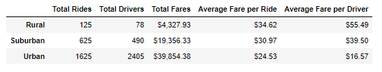
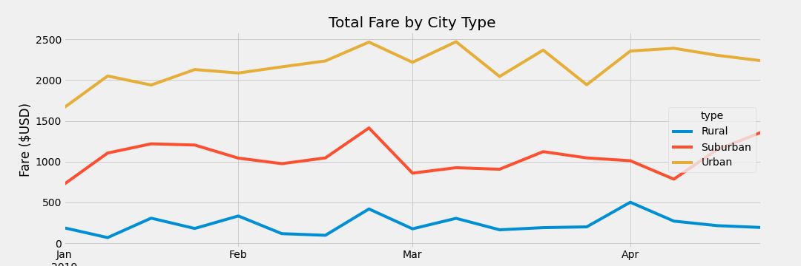

# PyBer_Analysis

## Overview
The purpose of this project was to utilize Jupyter Notebook to visualize ridesharing data for urban, suburban, and rural sectors based on fare, driver counts, and ride counts through the construction of dataframes and using filtered data to create a multiple line chart through the code. This line chart was to compare the total fares by each city type and through utilizing groupby functions we were able to make our filtered dataframes for our calculations. By doing these calculations, we can visualize which areas are the most profitable as well as how distributed our markets are for our rideshares in terms of city types.

## Results
As you can see with the chart data here: 

as well as our multiple line chart: 

Through running our various filters on this project we were able to draw these specific conclusions about our distribution and differences in ride share data across the various city types:

- Rural is our smallest portion of our total rideshares at 125 rides or roughly 6% of our total rideshares. We have 78 drivers and only generated $4,327.93 in fares. However, due to the small density of drivers in comparison to the other areas, we do have the largest average fare per ride and driver by a massive amount. Average fare per driver is at $55.49 almost $40 higher than the urban drivers and beats them on an average per ride basis by roughly $10 at $34.62. Which means we are generating the highest amount of revenue from each rider and paying our drivers the most out of any of the three regions, most likely due to the amount of distance that riders need to drive in this region.
- Suburban is right in the middle as a catagory at 625 rides or 30% of our rides as well as 490 drivers. This region generates roughly 30% of our revenue as well at $19,356.33 in fares. Suburban seems to like to stick right in the middle with its median rider density resulting in an average fare per driver at $39.50 and an average fare per ride at $30.97. These are still larger than the urban region by roughly $13 and $6 respectively, but is much smaller than the rural data we have. Theoretically, this can be explained through increased rider population and proximity to regional attractions whereas in the rural areas all destinations are much farther away.
- Urban is the largest density of revenues, rides, and drivers. Urban makes up rought 64% of our rides with 1625 rides out of 2075. We have 2405 drivers which is roughly 4.25 times the amount of drivers as the rural and suburban driver populations combined. It makes up roughly 63% of our revenue at $39,854.38, which is why if you view our line chart; Urban towers over all sections. However, based on the same theory that ride fare and driver fare are heavily influenced by proximity and driver population density, average fare per ride and per driver are miniscule compared to the other regions. Average fare per ride is $24.53 and average fare per driver is at $16.57. Since there are more drivers to pick up all the rides, and most likely, these rides are likely to have the shortest commute, these data points were doomed to be outdone by the other regions.
- All three regions see large fare spikes near the end of February and Rural and Urban see a significant spike in fare amounts right when April starts.

## Summary
When looking over these desparities in the data we have to consider the major factors of commute distance, total driver population, and total number of rides. My first logistical change for our business to consider our data more properly would be to collect data based on the average commute distance and the types of rides each area is servicing on average based on catagory. Rural areas are likely to be using ride shares for high distance travel such as airports or for rides to a nearby city with mileages in the higher double digits versus an urban environment would encourage shorter fares such as rides to the bar that probably are 10-20 minute rides. This could allow us to better understand the disparity in the average fare per driver in rural and urban city types. Secondly, we see large revenue spikes near the end of February and at the start of April, I would perform some market analysis on what the types of rides were in the region were the most popular and what events were going on in each region. We can then see if this is something we can market to riders and drivers next year to offer deals/driver incentives or increase advertising efforts to increase ride counts and ensure we have the most drivers we can to ensure the quickest response time for our customers. I would especially look at the end of February for our Suburban region since this was the highest revenue spike for the whole year in that area. Finally, due to that larger fare disparity for urban rides, I would recommend either increasing urban fares slightly across the board or utilize a surge function similar to Uber in the urban areas in times of great demand such as during those evens we found during our market research. This would allow us to address this driver fare issue in the urban areas.

### In conclusion:
- Collect ride data about average mileage and destination types to better visualize what's causing our fare variations on average ride and driver fares.
- Perform market analysis on the spikes in revenue in the line chart to see if we can find events or other advertising/business opportunities in the future to increase rides.
- Increase urban fares slightly either entirely or by using a "surge" function during times of great demand.
